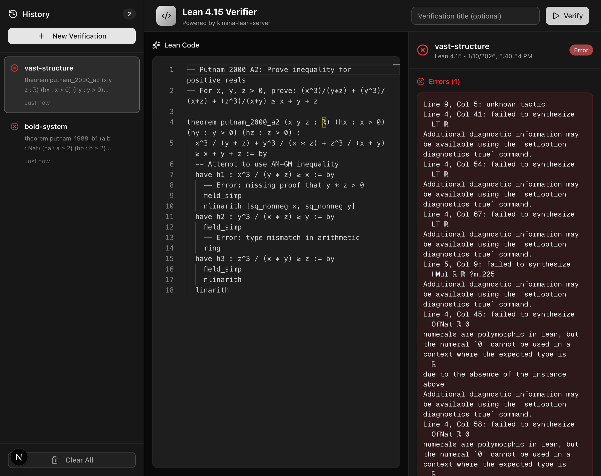

<div align="center">

# Lean UI

**A modern web interface for verifying Lean proofs**

[](https://opensource.org/licenses/MIT)
[](https://leanprover.github.io/)

[Features](#features) • [Quick Start](#quick-start) • [Usage](#usage) • [Tech Stack](#tech-stack) • [Contributing](#contributing)

</div>

---

## Features

- **Monaco Editor** - Professional code editor with Lean syntax highlighting
- **Real-time Verification** - Instant feedback on your Lean proofs via [kimina-lean-server](https://github.com/project-numina/kimina-lean-server)
- **Smart Error Display** - Clear, formatted errors and warnings with precise line/column positions
- **Verification History** - Automatic saving of all verifications with localStorage persistence

## Screenshot



## Quick Start

### Prerequisites

- **Node.js** 18 or higher
- **Docker** (for running the Lean verification backend)

### Installation

1. **Clone the repository**
   ```bash
   git clone https://github.com/yourusername/lean-ui.git
   cd lean-ui
   ```

2. **Start the backend server**
   ```bash
   cd backend
   cp .env.template .env
   docker compose up -d
   ```
   
   This starts the kimina-lean-server on port 10000. Verify it's running:
   ```bash
   docker compose logs -f
   ```

3. **Install frontend dependencies**
   ```bash
   cd ..
   npm install
   ```

4. **Start the development server**
   ```bash
   npm run dev
   ```

5. **Open your browser**
   
   Navigate to [http://localhost:3000](http://localhost:3000)

That's it! You should see the Lean 4.15 Verifier interface ready to use.

### Stopping the Services

```bash
# Stop the backend
cd backend && docker compose down

# Stop the frontend (Ctrl+C in the terminal running npm run dev)
```

## Usage

### Basic Workflow

1. **Write Lean Code** - Enter your Lean 4.15 code in the Monaco editor
2. **Add Title (Optional)** - Give your verification a descriptive name, or let it auto-generate
3. **Click Verify** - Submit your code for verification
4. **View Results** - See success, errors, or warnings in the results panel
5. **Browse History** - Access past verifications from the sidebar
6. **Manage History** - Delete individual entries or clear all history

### Example Lean Code

```lean
-- Simple theorem
theorem add_comm (a b : Nat) : a + b = b + a := by
  rfl

-- Proof by induction
theorem add_zero (n : Nat) : n + 0 = n := by
  induction n with
  | zero => rfl
  | succ n ih => simp [Nat.add_succ, ih]
```

## Configuration

### Environment Variables

Create a `.env.local` file in the root directory (optional):

| Variable | Default | Description |
|----------|---------|-------------|
| `KIMINA_SERVER_URL` | `http://localhost:10000` | URL of the kimina-lean-server backend |

### Backend Configuration

The backend defaults to Lean 4.15.0. To customize, edit `backend/.env`:

```bash
LEAN_SERVER_LEAN_VERSION=v4.15.0  # Change Lean version
LEAN_SERVER_MAX_REPLS=14           # Max concurrent REPL instances
LEAN_SERVER_MAX_WAIT=60            # Max wait time in seconds
```

See the [kimina-lean-server documentation](https://github.com/project-numina/kimina-lean-server) for all options.

## Tech Stack

- **Frontend**: Next.js 16, React 18, TypeScript
- **Styling**: TailwindCSS v4, shadcn/ui
- **Editor**: Monaco Editor (VS Code editor)
- **Backend**: [kimina-lean-server](https://github.com/project-numina/kimina-lean-server) (FastAPI + Lean REPL)
- **Storage**: localStorage (client-side persistence)

## Project Structure

```
lean-ui/
├── src/
│   ├── app/
│   │   ├── api/verify/          # API route for Lean verification
│   │   ├── page.tsx             # Main application page
│   │   ├── layout.tsx           # Root layout with dark theme
│   │   └── globals.css          # Global styles
│   ├── components/
│   │   ├── ui/                  # shadcn/ui components
│   │   ├── CodeEditor.tsx       # Monaco editor wrapper
│   │   ├── HistorySidebar.tsx   # Verification history sidebar
│   │   ├── LeanVerifier.tsx     # Main verifier component
│   │   └── VerificationPanel.tsx # Results display panel
│   ├── hooks/
│   │   └── useVerificationHistory.ts  # History management hook
│   ├── lib/
│   │   ├── nameGenerator.ts     # Random name generator
│   │   └── utils.ts             # Utility functions
│   └── types/
│       └── verification.ts      # TypeScript interfaces
└── backend/                     # kimina-lean-server
    ├── Dockerfile
    ├── compose.yaml
    └── .env                     # Backend configuration
```

## Contributing

Contributions are welcome! Please feel free to submit a Pull Request. For major changes, please open an issue first to discuss what you would like to change.

### Development Setup

1. Fork the repository
2. Create your feature branch (`git checkout -b feature/amazing-feature`)
3. Commit your changes (`git commit -m 'Add some amazing feature'`)
4. Push to the branch (`git push origin feature/amazing-feature`)
5. Open a Pull Request

### Code Style

- Follow the existing code style
- Use TypeScript for type safety
- Write meaningful commit messages
- Add comments for complex logic

## Troubleshooting

### Backend won't start
- Ensure Docker is running
- Check if port 10000 is available: `lsof -i :10000`
- View logs: `cd backend && docker compose logs -f`

### Frontend connection errors
- Verify backend is running: `curl http://localhost:10000/api/check`
- Check `KIMINA_SERVER_URL` environment variable
- Ensure no firewall is blocking port 10000

### Monaco editor not loading
- Clear browser cache
- Check browser console for errors
- Ensure JavaScript is enabled

## License

This project is licensed under the MIT License - see the [LICENSE](LICENSE) file for details.

## Acknowledgments

- [Lean Prover](https://leanprover.github.io/) - The Lean theorem prover
- [kimina-lean-server](https://github.com/project-numina/kimina-lean-server) - Fast Lean verification server
- [shadcn/ui](https://ui.shadcn.com/) - Beautiful UI components
- [Monaco Editor](https://microsoft.github.io/monaco-editor/) - VS Code's editor

## Contact

For questions or feedback, please open an issue on GitHub.

---

<div align="center">
Made for the Lean community
</div>
